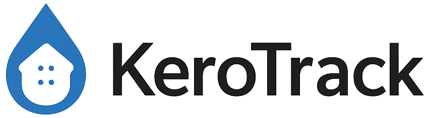

# KeroTrack v2

KeroTrack v2 is a full refactor of [KeroTrack](https://github.com/MrSiJo/KeroTrack) (now archived) — a domestic heating-oil monitoring system that ingests MQTT messages from a Watchman Sonic transmitter (via LilyGO LoRa32 + OpenMQTTGateway) and exposes them through an API + SPA dashboard.

> **Status: pre-alpha.** This repo currently contains only the design spec; backend and frontend implementation start once the plan is approved.

## What changed from v1

v1 was a Flask + Socket.IO + Plotly app, a separate MQTT subscriber service, and several cron-driven Python scripts, all configured via a hand-edited YAML file and installed onto the host with `KeroTrack_Setup.sh`.

v2 collapses all of that into:

- **`backend/`** — FastAPI + async SQLAlchemy + APScheduler + `aiomqtt`. Owns ingest, analysis, scheduling, notifications, and the JSON API. Single image, single process.
- **`frontend/`** — SvelteKit + TypeScript + Tailwind + ECharts SPA, served by nginx.
- **`compose.yaml`** — two-service stack (`backend`, `frontend`) on a private Docker network, persistent named volumes for DB and logs.
- **DB-backed settings** — every value that used to live in `config/config.yaml` (tank dimensions, boiler spec, MQTT credentials, schedules, Apprise URLs, …) now lives in a `settings` table, edited via `/api/settings` and the Settings page in the UI. The only `.env` keys are bootstrap concerns: `DATABASE_URL`, `PORT`, `TZ`, `LOG_LEVEL`.
- **No host cron, no systemd units, no `KeroTrack` system user.** APScheduler runs the analysis, cost analysis, and notifier jobs in-process.

## Compatibility constraints kept from v1

- **MQTT contract is identical** so [KeroTrack-display](https://github.com/MrSiJo/KeroTrack-display) (the CYD ESP32 dashboard) keeps working unchanged. See the spec for the locked field list on `oiltank/level` and `oiltank/analysis`.
- **Home Assistant integration** files (`ha-oilanalysis.yaml`, `lovelace-dashboard.yaml`) keep working — sensor field names are stable.
- **SQLite schema** for `readings`, `analysis_results`, `refill_periods`, `energy_metrics`, `hdd_data`, `cost_analysis`, `refill_data` is preserved; v1 → v2 migration is data-only.

## Plan

The full design + implementation plan is in [`docs/plans/2026-04-25-v2-redesign.md`](docs/plans/2026-04-25-v2-redesign.md).

## Layout

```
KeroTrack-v2/
├── backend/        # FastAPI app (kerotrack package), pyproject.toml, Dockerfile, tests
├── frontend/       # SvelteKit + TS app, nginx Dockerfile
├── compose.yaml    # docker compose stack
├── docs/           # plans + ADRs
└── assets/         # logo, screenshots
```

## License

Creative Commons Attribution-NonCommercial 4.0 (CC BY-NC 4.0). See [LICENSE](LICENSE).
