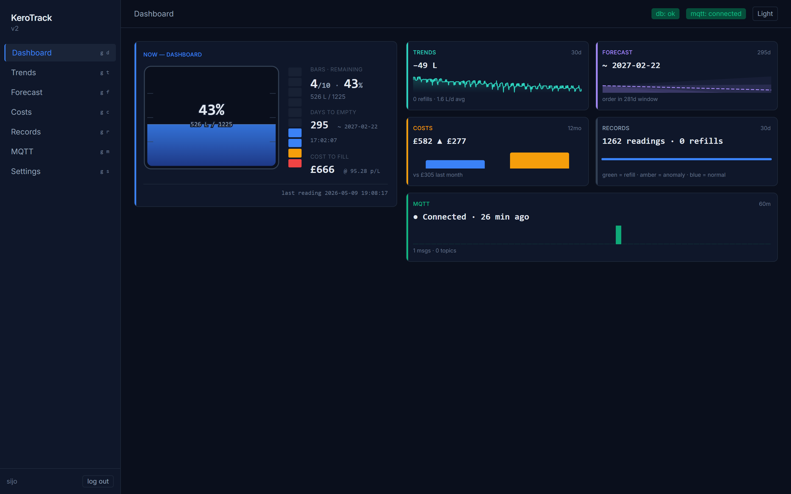
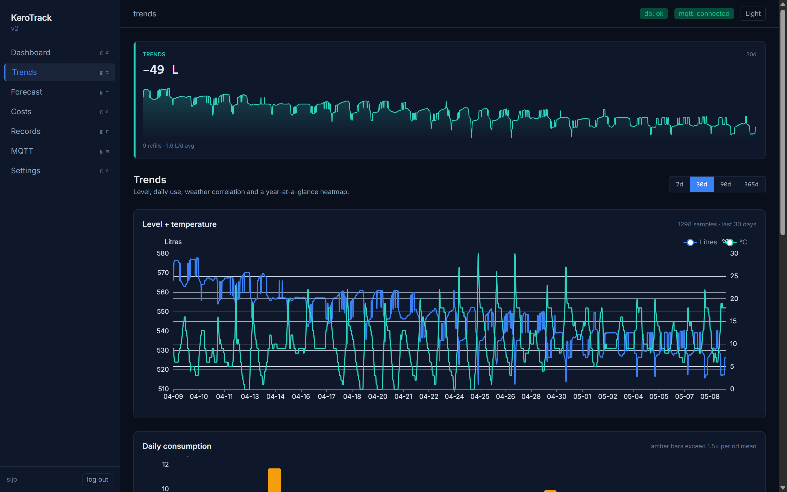
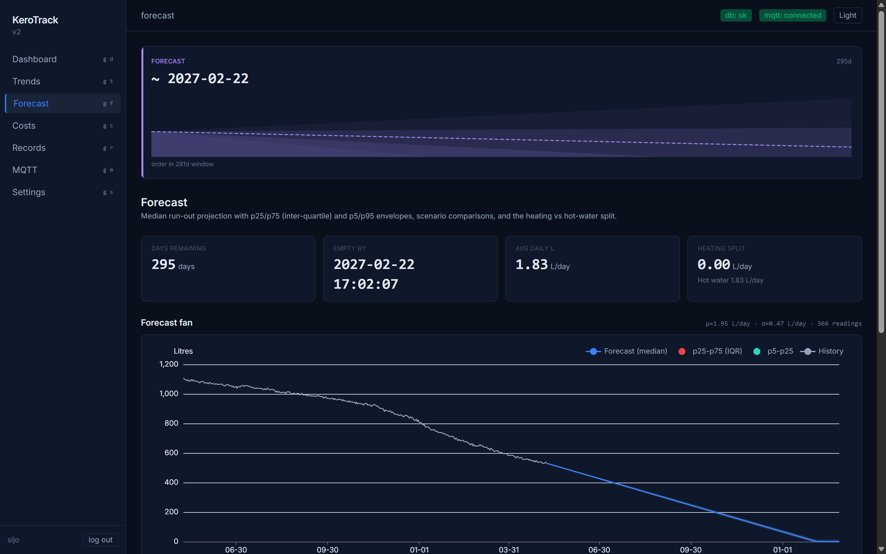
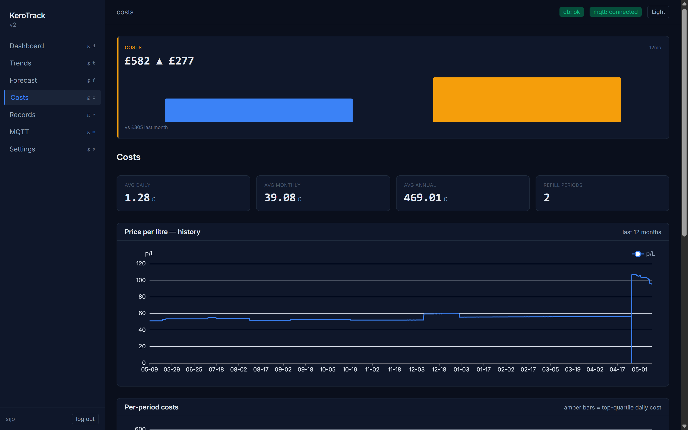
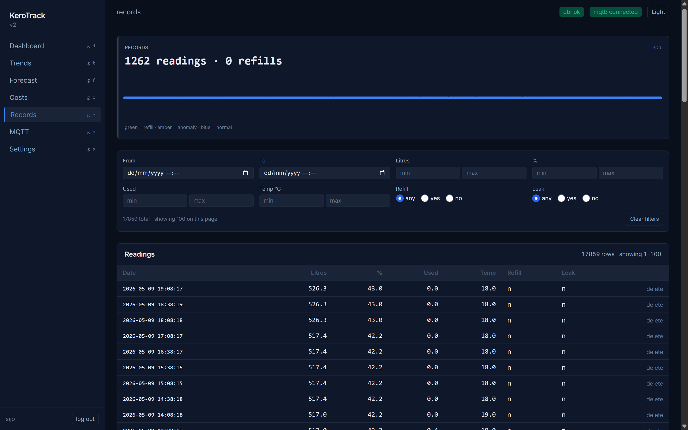
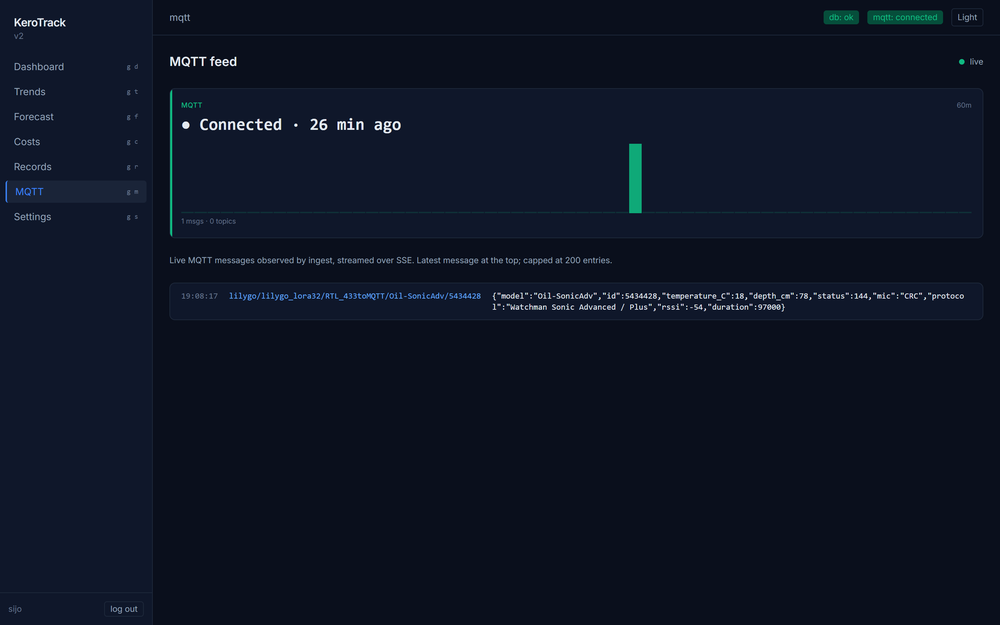
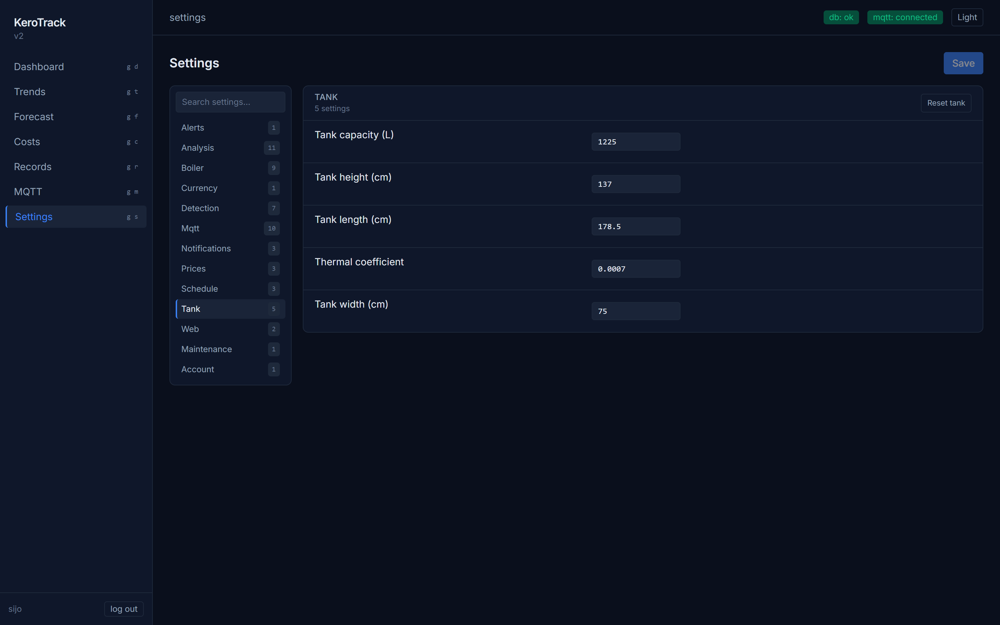

# KeroTrack

KeroTrack is a self-hosted, container-native domestic heating-oil monitor. A FastAPI backend ingests MQTT readings from a Watchman Sonic Advanced transmitter (relayed by a LilyGO LoRa32 + OpenMQTTGateway), computes consumption analytics + cost forecasts, and serves them to a SvelteKit single-page app. There is no manual logging step — the tank's level shows up on the dashboard within seconds of each reading.

It is built around a few ideas:

- **MQTT-first.** The Watchman publishes one reading every ~30 minutes; the ingest task subscribes, normalises, persists, and re-broadcasts the enriched payload over MQTT for downstream displays (KeroTrack-display, Home Assistant).
- **DB-backed settings.** Tank dimensions, boiler spec, MQTT credentials, schedules, Apprise URLs, etc. live in a `settings` table edited via the Settings page. The only `.env` keys are bootstrap concerns (`APP_SECRET_KEY`, ports, timezone, log level).
- **In-process scheduling.** APScheduler runs the analysis, cost-analysis, and notifier jobs. No host cron, no systemd units.
- **Single operator.** ADR-0005 — argon2id session-cookie auth, one user per deployment, first-run `/setup` wizard.

## Screenshots



<table>
  <tr>
    <td></td>
    <td></td>
    <td></td>
  </tr>
  <tr>
    <td align="center"><sub>Trends</sub></td>
    <td align="center"><sub>Forecast</sub></td>
    <td align="center"><sub>Costs</sub></td>
  </tr>
  <tr>
    <td></td>
    <td></td>
    <td></td>
  </tr>
  <tr>
    <td align="center"><sub>Records</sub></td>
    <td align="center"><sub>MQTT</sub></td>
    <td align="center"><sub>Settings</sub></td>
  </tr>
</table>

## Quickstart — pull images from GHCR

This is the easiest path. You need `docker` (with `compose`) and a way to generate a random secret. No source code, no build toolchain, no Python.

```bash
# 1. Grab the compose file
curl -O https://raw.githubusercontent.com/MrSiJo/KeroTrack/main/compose.yaml

# 2. Generate a strong secret (≥32 chars; the loader rejects shorter ones)
echo "APP_SECRET_KEY=$(openssl rand -hex 32)" > .env

# 3. Pull and start
docker compose pull
docker compose up -d
```

Open the dashboard in a browser at `http://<docker-host>:9177` — substitute your Docker host's IP or hostname (use `localhost` only if you ran the stack on the same machine you're browsing from). The first-run `/setup` page prompts you to create the single operator account (password ≥ 12 chars). After login the `/onboarding` wizard collects the basics:

1. **MQTT** — broker host/port, username, password, and the topic the LilyGO publishes to. The default subscribe pattern is `lilygo/+/RTL_433toMQTT/Oil-SonicAdv/+` (the `+` wildcards mean any LilyGO hostname and any Watchman device ID match without further configuration). Under "Advanced — output topics" the wizard exposes the three publish topics KeroTrack uses (defaults: `oiltank/level`, `oiltank/analysis`, `oiltank/cost_analysis`) for KeroDisplay / Home Assistant compatibility.
2. **Tank** — capacity (L), length / width / height (cm). Defaults match a standard 1225 L domestic tank.
3. **Boiler** — model, burner, nozzle (gph), input/output kW, efficiency. All optional; defaults are reasonable averages.

You can re-tune any of these later from **Settings**.

### Pinning a specific image tag

`compose.yaml` defaults to `:latest`. To pin a release:

```bash
echo "KEROTRACK_TAG=v1.0.0" >> .env
docker compose pull && docker compose up -d
```

Available tags live on the GHCR package pages:

- <https://github.com/MrSiJo/KeroTrack/pkgs/container/kerotrack-api>
- <https://github.com/MrSiJo/KeroTrack/pkgs/container/kerotrack-ui>

Or check <https://github.com/MrSiJo/KeroTrack/releases> for the matching changelog.

Tags published by CI:

| Trigger                                | Tags produced                                       |
| -------------------------------------- | --------------------------------------------------- |
| push to `main`                         | `latest`, `sha-<short>`                             |
| release-please PR merged (cuts a tag)  | `vX.Y.Z`, `X.Y`, `X`, `latest`                      |
| pull request                           | (build-only, no push)                               |

Both images are `linux/amd64`.

### Bind-mounting the data volume to a host path

`compose.yaml` ships with Docker-managed named volumes (`kerotrack-data`, `kerotrack-logs`). To bind to host paths instead, drop a `compose.override.yaml` next to `compose.yaml` — see [`compose.override.yaml.example`](compose.override.yaml.example) for two patterns.

The override file is gitignored, so deployment-specific paths stay off the repo.

## Quickstart — local dev (build from source)

For day-to-day development on the backend or frontend.

### Backend

```bash
cd backend
pip install -e .
uvicorn --factory kerotrack.main:create_app --host 0.0.0.0 --port 9176 --reload
```

### Frontend — Vite proxies `/api` to `localhost:9176`

```bash
cd frontend
npm install
npm run dev
```

Open the URL Vite prints (usually <http://localhost:5173>).

### Container build via compose

```bash
docker compose -f compose-dev.yaml up --build
```

`compose-dev.yaml` builds both images locally and bind-mounts `/dockerdata/kerotrack/{data,logs}` for direct host access.

### Tests

```bash
cd backend && python -m pytest          # ~286 tests, ~50s
python -m pytest tests/api/test_security_invariants.py   # security contract, ~7s

cd frontend && npm test
npm run check
```

Pre-commit hooks (`pre-commit install`) run gitleaks, bandit, ruff, and an IP-literal guard on every commit.

## Configuration

Configuration lives in two places.

### `.env` — boot-time secrets

| Variable                | Required | Default                                            | Notes                                                 |
| ----------------------- | -------- | -------------------------------------------------- | ----------------------------------------------------- |
| `APP_SECRET_KEY`        | yes      | —                                                  | ≥32 chars. Generate with `openssl rand -hex 32`. Used to sign session cookies (ADR-0005). |
| `TZ`                    | no       | `Europe/London`                                    | Container timezone. Affects log timestamps + scheduled jobs. |
| `LOG_LEVEL`             | no       | `INFO`                                             | Standard Python log levels.                           |
| `BACKEND_PORT`          | no       | `9176`                                             | Host port mapped to the API container.                |
| `FRONTEND_PORT`         | no       | `9177`                                             | Host port mapped to the UI container.                 |
| `DATABASE_URL`          | no       | `sqlite+aiosqlite:////app/data/kerotrack.db`       | Override only if you want a non-default DB path.      |
| `SESSION_COOKIE_SECURE` | no       | `true`                                             | Set to `false` for plain-HTTP local dev. Defaults assume nginx-proxy-manager terminates TLS upstream. |
| `KEROTRACK_TAG`         | no       | `latest`                                           | Image tag to pull from GHCR. Only used by `compose.yaml`. |

### Settings catalogue (UI) — runtime tunables

After first-run setup, every other knob lives under **Settings**:

- **MQTT:** broker, port, username, password, subscribe + publish topics, idle-reconnect window, broadcast interval.
- **Tank:** capacity, dimensions, thermal coefficient.
- **Boiler:** model, burner, nozzle, fuel rate, input/output kW, fuel pump pressure, efficiency, flue CO2.
- **Prices:** YourNRG scrape URL + cron, BoilerJuice URL + cron.
- **Notifications:** Apprise URLs (one per line), notification cron.
- **Costs:** seasonal HDD source, base/peak rates, etc.

Secret-flagged settings (MQTT password, Apprise URLs) redact on read and never appear in the audit log. Changes are recorded in `setting_changes` for traceability.

## Architecture

KeroTrack is two services on a shared bridge network:

```
┌─────────────────┐  /api/*  ┌────────────────────────────────┐
│ kerotrack-ui    │ ───────► │ kerotrack-api                  │
│ nginx + SPA     │          │ FastAPI · async SQLAlchemy 2.x │
│ port 80 → :9177 │          │ APScheduler · aiomqtt          │
│                 │          │ port 9176                      │
└─────────────────┘          └─────────────┬──────────────────┘
                                           │
                                           ▼
                                    SQLite + APScheduler
                                    (single-worker, in-process)

                                           ▲
                                           │ MQTT
                                           │
                                  ┌────────┴────────┐
                                  │ LilyGO LoRa32   │
                                  │ + OpenMQTTGw    │
                                  │   ▲             │
                                  │   │ 433 MHz     │
                                  │   │             │
                                  │ Watchman Sonic  │
                                  └─────────────────┘
```

### Backend

`backend/kerotrack/main.py:create_app()` is the single source of truth for app wiring. The lifespan handler:

1. Validates `APP_SECRET_KEY` and bootstraps the engine.
2. Creates the schema (`Base.metadata.create_all`) and seeds defaults into the `settings` catalogue.
3. Wires the long-lived services into `app.state` — MQTT ingest task, settings change subscriber, APScheduler, pubsub bus for SSE clients.

The MQTT ingest task subscribes to the topic stored in `mqtt.topic_readings`, normalises the Watchman payload, runs `recalc.process()` to derive level/percentage/cost/HDD, persists the row, and republishes the enriched payload to `mqtt.topic_readings_publish` and `mqtt.topic_analytics`. Settings changes (e.g. swapping the broker host) trigger a live reconnect — no restart needed.

### Frontend

SvelteKit 2 + Tailwind 3 + ECharts. Routes in `frontend/src/routes/`, shared components in `frontend/src/lib/components/`, the typed API client in `frontend/src/lib/api.ts`. The dashboard answers "how full is the tank, what is it costing, and when will it run out?" — a hero tank silhouette, a 30-day spend / consumption chart, a cost forecast fan, and a calendar heatmap of refill events.

## Storage layout

Run with the default `compose.yaml` (named volumes, managed by Docker):

| Volume               | Mounted at  | Contents                       |
| -------------------- | ----------- | ------------------------------ |
| `kerotrack-data`     | `/app/data` | SQLite DB, price cache.        |
| `kerotrack-logs`     | `/app/logs` | App logs.                      |

Run with `compose-dev.yaml` and the same paths bind to `/dockerdata/kerotrack/{data,logs}` on the host instead — easier to inspect, less portable. To get the same host-path layout under the production `compose.yaml`, copy `compose.override.yaml.example` to `compose.override.yaml` and adapt.

## Container images and CI

Images are published to the GitHub Container Registry:

- `ghcr.io/mrsijo/kerotrack-api`
- `ghcr.io/mrsijo/kerotrack-ui`

Both images are `linux/amd64`.

Two workflows drive publishing:

- `.github/workflows/build-images.yml` — every push to `main` produces `:latest` + `:sha-<short>`.
- `.github/workflows/release-please.yml` — automates semantic-versioned releases (see below).

### Versioned releases — automated via release-please

Versioning follows [Conventional Commits](https://www.conventionalcommits.org/) and is fully automated:

1. Push commits to `main` with prefixes like `feat:`, `fix:`, `feat!:` (breaking), or `chore:`/`docs:`/`ci:` (no version bump).
2. [release-please](https://github.com/googleapis/release-please) maintains a `chore(main): release X.Y.Z` PR that accumulates everything since the last release, with an auto-generated `CHANGELOG.md` and the proposed version (`feat:` → minor, `fix:` → patch, `feat!:` → major).
3. **Merging that PR** cuts the `vX.Y.Z` git tag, creates the matching GitHub Release, and triggers an image build that pushes `:vX.Y.Z`, `:X.Y`, `:X`, and `:latest` to GHCR.

State is tracked in `.release-please-manifest.json`. To skip a release for a window, simply don't merge the Release PR — it accumulates until you do.

## Integrations

- **[KeroTrack-display](https://github.com/MrSiJo/KeroTrack-display)** — CYD ESP32 dashboard. Reads `oiltank/level` and `oiltank/analysis` over MQTT.
- **Home Assistant** — `ha-oilanalysis.yaml` and `lovelace-dashboard.yaml` provide sensors and a Lovelace dashboard.

## Project layout

```
.
├── .github/workflows/                    # CI: build + push GHCR images, release-please
├── backend/                              # FastAPI app
│   ├── kerotrack/
│   │   ├── api/                          # routes + middleware
│   │   ├── models/                       # SQLAlchemy models
│   │   ├── ingest/                       # MQTT ingest + recalc pipeline
│   │   ├── prices/                       # external price scrapers
│   │   ├── notifications/                # Apprise notifier
│   │   ├── scheduler/                    # APScheduler wiring
│   │   ├── services/                     # business logic
│   │   ├── settings/                     # catalogue + seeds + service
│   │   └── main.py                       # create_app() — single source of truth
│   └── tests/
├── frontend/                             # SvelteKit SPA
│   └── src/
│       ├── lib/                          # typed client, stores, components
│       └── routes/                       # one component per route
├── compose.yaml                          # GHCR pull (default)
├── compose-dev.yaml                      # source-build for local dev
├── compose.override.yaml.example         # bind-mount template for personal deploys
└── docs/adr/                             # architecture decisions
```

## Reference

- Project conventions for Claude Code: [`CLAUDE.md`](CLAUDE.md)
- Architecture decisions: [`docs/adr/`](docs/adr/)

## License

Creative Commons Attribution-NonCommercial 4.0 (CC BY-NC 4.0). See [LICENSE](LICENSE).
